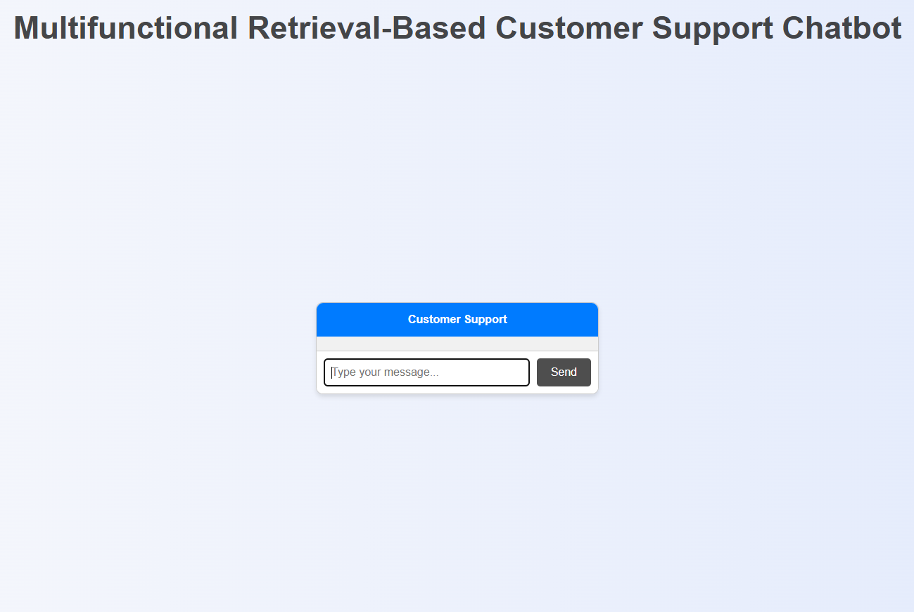
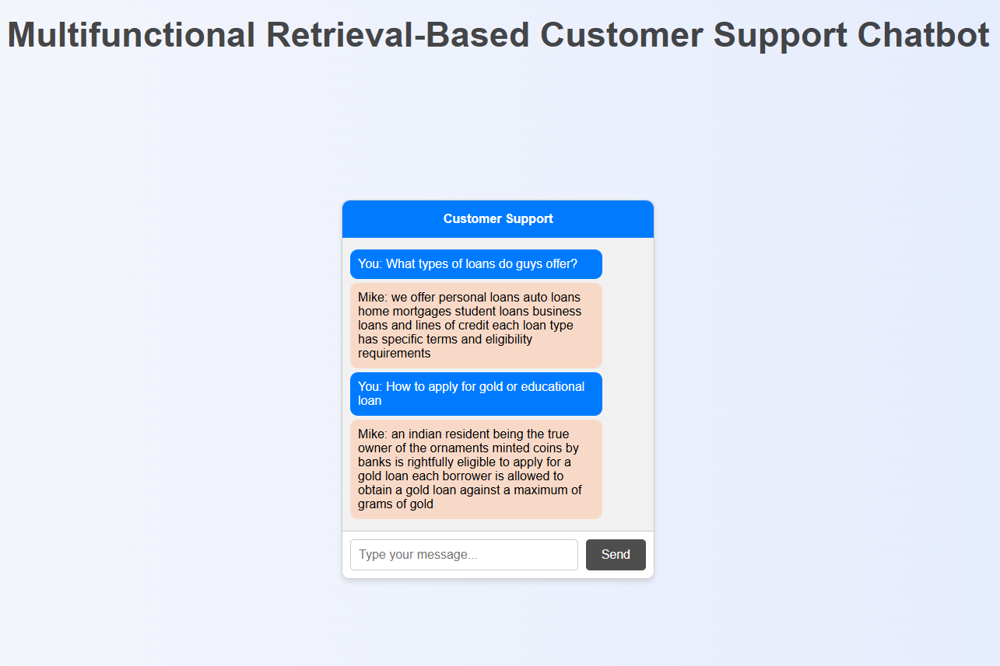
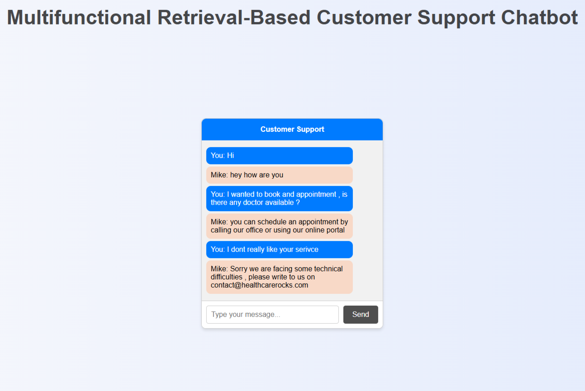

<h2> Multifunctional Fine Tuned Retrieval-Based  Chatbot Leveraging RoBERTa , BART Transformers </h2>

## Overview 
The "Multifunctional Fine Tuned Retrieval-Based Chatbot" is an advanced AI-driven system designed to provide accurate, context-aware responses to user queries and can be utilized for customer support. The chatbot is also able to conduct Sentiment Analysis such as if the given query is positive , negative and neutral. This chatbot leverages state-of-the-art language models, specifically RoBERTa and BART Transformers, to enhance its natural language processing capabilities. The model is trained upon different domains like healthcare , finance and normal conversations, It have learned the questions and answers patterns and could be used for customer support,etc.

## Key Components
**RoBERTa Transformer**: 
* RoBERTa (Robustly optimized BERT approach) is utilized for its superior performance in understanding and generating human-like text. It excels in tasks such as text classification, sentiment analysis, and question-answering.

**BART Transformer**: 
* BART (Bidirectional and Auto-Regressive Transformers) is employed for its effectiveness in text generation, summarization, and translation. It combines the strengths of both bidirectional and autoregressive models, making it highly versatile for various NLP tasks.

**Fine-Tuning**: 
* The chatbot is fine-tuned on domain-specific data to improve its performance in targeted areas. This customization ensures that the responses are highly relevant and accurate

**Retrieval Mechanism with Cosine Similarity**: 
* The chatbot uses cosine similarity to identify the closest responses from a predefined dataset. By setting a threshold, it ensures that only the most relevant responses are retrieved, enhancing the accuracy of the system.

**Data Augmentation with NLP-Aug**: 
* To improve the robustness and diversity of the training data, NLP-Aug is used for data augmentation. This helps in creating a more comprehensive dataset, allowing the chatbot to handle a wider range of queries effectively.

**Sentiment Analysis with TextBlob**:
* TextBlob is implemented to identify and classify "negative , positive , neutral" questions. This enables the chatbot to tailor its responses based on the sentiment of the input, providing more contextually appropriate answers.

**Sentence Transformers with RoBERTa**: 
* The system leverages sentence transformers, specifically RoBERTa, to create high-quality embeddings for text data. These embeddings are crucial for the retrieval and similarity calculations, ensuring that the chatbot understands and processes queries accurately.

**SQL Database for Query Storage**: 
* A SQL database is employed to store user queries and chatbot responses. This allows for efficient data management, analysis, and future improvements.

**Web Interface with Flask**: 
* The chatbot is integrated into a user-friendly web interface built with Flask, HTML, CSS and JavaScript. This setup ensures easy accessibility and engagement for users.

## Applications
### This multifunctional chatbot is suitable for a wide range of applications, including:

- **Customer Support**: Providing accurate and context-aware responses to customer queries.

- **Research Assistance**: Assisting researchers with information retrieval and summarization.

- **Content Generation**: Generating human-like text for various content creation needs.

## Installation and Setup
### Prerequisites
1. transformers
2. torch
3. numpy
4. scipy
5. scikit-learn
6. textblob
7. sentence-transformers
8. sqlalchemy
9. flask
10. nlpaug
11. python
12. mysql-connector-python
13. pandas
14. pickle 
15. cosine_similarity
16. stsb-roberta-base
17. facebook/bart-base
18. hugging face

## Images
### HomePage Header:

### Conversations With Chatbot :
### Helping with Loan Queries:

### Conversations With Chatbot :
### Handling Out Of Dataset Trained Queries:

## Video
### Video Demonstration Of The Project.
<video width="720" height="440" controls>
  <source src="video/Chatbot11.mp4" type="video/mp4">
  Your browser does not support the video tag.
</video>

## License
This project is licensed under the MIT License. 

## Contributions
Please Feel free to contribute to this project by submitting issues or pull requests.

Any enhancements, bug fixes, or optimizations are extremely welcomed!

